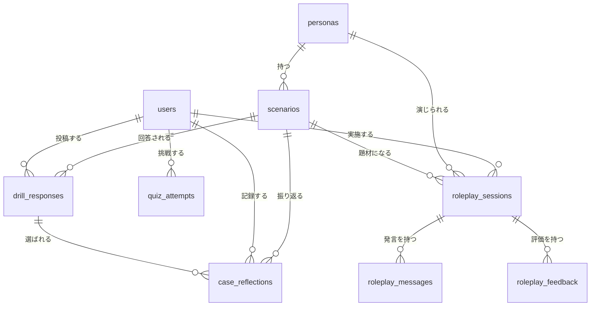

# Mentor Forge 仕様書

最終更新: 2026-09-05

---

## 1. 概要

メンタリング（1on1）のスキルを、**学ぶ → 一人で試す → 三人で実践する**という順序で身につけるための学習アプリ。

知識をクイズで確認したあと、AIが演じる相談者を相手に一人で対話練習ができ、さらに実際の人間3人で役割を交代しながら練習してフィードバックを記録できる。

| 項目 | 内容 |
| --- | --- |
| 想定利用者 | メンター役を担うことになった人（新任のリーダー、先輩社員など） |
| 利用形態 | Webアプリ。アカウント登録して利用する |
| 公開URL | `https://<host>/mentor-forge/public/` |

---

## 2. 機能一覧

| 機能 | 概要 | 認証 |
| --- | --- | --- |
| トップページ | アプリ紹介とログイン／新規登録への導線 | 不要 |
| ダッシュボード | 練習回数とクイズ最高得点、直近の履歴 | 必要 |
| ケースドリル | ケースへ自由回答し、回答後に他者回答を匿名で比較 | 必要 |
| 対話の振り返り診断 | 利用前後の自己認識を6項目で記録し、項目別の変化を表示 | 必要 |
| 実践フォローアップ | ケースの次の行動について2週間後・4週間後の実践を記録 | 必要 |
| クイズ | 傾聴・質問・共感の4択問題。即時採点と解説 | 必要 |
| ソロ練習 | AIが演じる相談者と1対1でテキスト対話。終了時にスコアと振り返り | 必要 |
| トリオ練習 | メンター／メンティ／観察者の3役でルームを作り、相互フィードバックを記録 | 必要 |
| アカウント設定 | プロフィール、外観、セキュリティ（2要素認証・パスキー） | 必要 |

---

## 3. 画面とルーティング

`routes/web.php` と `routes/settings.php` に定義。

### 公開

| メソッド | パス | ルート名 | 説明 |
| --- | --- | --- | --- |
| GET | `/` | `home` | トップページ |

Fortify が `/login` `/register` `/forgot-password` などの認証系ルートを提供する。

### 要認証（`auth` + `verified`）

| メソッド | パス | ルート名 | 説明 |
| --- | --- | --- | --- |
| GET | `/dashboard` | `dashboard` | ダッシュボード |
| GET | `/cases` | `cases.index` | ケース一覧 |
| GET | `/cases/{scenario}` | `cases.show` | ケース詳細。回答前は他者回答を取得しない |
| POST | `/cases/{scenario}/responses` | `cases.responses.store` | 自由回答を1回だけ投稿 |
| POST | `/cases/{scenario}/reflection` | `cases.reflection.store` | 匿名回答の選択、差分振り返り、次の行動を保存 |
| GET/POST | `/diagnosis` | `diagnosis.show/store` | 利用前・利用後の自己認識を記録し、変化を表示 |
| GET/POST | `/reflections/{reflection}/follow-ups/{weeks}` | `follow-ups.show/store` | 2週間後・4週間後の実践記録 |
| GET | `/solo` | `solo.index` | ペルソナとシナリオの一覧 |
| POST | `/solo/start/{scenario}` | `solo.start` | セッション開始。相談者の第一声を自動投入 |
| GET | `/solo/{session}` | `solo.show` | 対話画面 |
| POST | `/solo/{session}/message` | `solo.message` | メンターの発言を送信し、相談者の返答を生成 |
| POST | `/solo/{session}/complete` | `solo.complete` | 終了。スコア算出と振り返りの保存 |
| GET | `/solo/{session}/result` | `solo.result` | 結果画面 |
| GET | `/trio` | `trio.index` | シナリオ一覧とルーム作成／参加 |
| POST | `/trio` | `trio.store` | ルーム作成。6桁のルームコードを発行 |
| POST | `/trio/join` | `trio.join` | ルームコードで参加 |
| GET | `/trio/{session}` | `trio.show` | ルーム画面 |
| POST | `/trio/{session}/feedback` | `trio.feedback` | フィードバック投稿。スコアを再計算 |
| GET | `/quiz` | `quiz.index` | 出題 |
| POST | `/quiz` | `quiz.submit` | 採点 |
| GET | `/quiz/result/{attempt}` | `quiz.result` | 結果と解説 |

### 設定（`auth`）

| パス | ルート名 | 備考 |
| --- | --- | --- |
| `/settings/profile` | `profile.edit` | |
| `/settings/appearance` | `appearance.edit` | `verified` 必須 |
| `/settings/security` | `security.edit` | `verified` ＋ パスワード再確認が必須 |

---

## 4. データモデル



### personas — 相談者の人物設定

| カラム | 型 | 説明 |
| --- | --- | --- |
| `name` | string | 氏名 |
| `role` | string | 立場（例: 入社2年目・営業職） |
| `background` | text | 背景 |
| `challenge` | text | 抱えている悩み |
| `tone` | string | 話し方の特徴 |
| `accent_color` | string | 画面上の識別色（既定 `#0f766e`） |

### scenarios — 練習の題材

| カラム | 型 | 説明 |
| --- | --- | --- |
| `persona_id` | FK | 相談者。削除時は連鎖削除 |
| `title` | string | シナリオ名 |
| `situation` | text | 状況説明 |
| `goal` | text | この練習の目標 |
| `difficulty` | string | 難易度（既定「初級」） |

### roleplay_sessions — 練習セッション（ソロ／トリオ共通）

| カラム | 型 | 説明 |
| --- | --- | --- |
| `user_id` `persona_id` `scenario_id` | FK(null可) | 削除時は NULL |
| `mode` | string | `solo` または `trio` |
| `status` | string | `active`（既定）／`completed` |
| `room_code` | string(8), unique | トリオのみ。英大文字6桁 |
| `mentor_name` `mentee_name` `observer_name` | string | トリオの担当者名 |
| `score` | tinyint | 0〜100 |
| `reflection` | text | 振り返り（ソロのみ） |
| `completed_at` | timestamp | 終了日時 |

### roleplay_messages — 対話ログ

| カラム | 型 | 説明 |
| --- | --- | --- |
| `roleplay_session_id` | FK | 連鎖削除 |
| `speaker` | string | `mentor` または `persona` |
| `content` | text | 発言内容 |

### drill_responses — ケースドリルの自由回答

| カラム | 型 | 説明 |
| --- | --- | --- |
| `user_id` | FK | 回答者。削除時は連鎖削除 |
| `scenario_id` | FK | 対象ケース。削除時は連鎖削除 |
| `content` | text | 自由回答（最大2,000文字） |

`user_id` と `scenario_id` の組み合わせはユニーク。投稿後の編集ルートは設けない。

### case_reflections — 回答比較後の振り返り

| カラム | 型 | 説明 |
| --- | --- | --- |
| `user_id` | FK | 振り返った利用者 |
| `scenario_id` | FK | 対象ケース |
| `selected_response_id` | FK（null可） | 選んだ他者回答。元回答削除時はNULL |
| `selected_response_content` | text | 履歴確認用の匿名回答スナップショット |
| `selection_reason` | text | 選んだ理由（最大2,000文字） |
| `difference` | text | 自分の回答との違い（最大2,000文字） |
| `next_action` | text | 次に試す行動（最大1,000文字） |

1利用者・1ケースにつき1件。自分の回答や別ケースの回答は選択できない。

### roleplay_feedback — トリオ練習の相互評価

| カラム | 型 | 説明 |
| --- | --- | --- |
| `roleplay_session_id` | FK | 連鎖削除 |
| `reviewer_role` | string | `observer` / `mentee` / `self` |
| `listening_score` `empathy_score` `question_score` | tinyint | 各1〜5 |
| `strengths` `improvements` | text | 良かった点／改善点 |

### diagnostic_assessments — 利用前後の対話の振り返り

| カラム | 型 | 説明 |
| --- | --- | --- |
| `user_id` | FK | 記録した利用者 |
| `phase` | string | `pre`（利用前）または`post`（利用後） |
| `responses` | JSON | 対話行動6項目への1〜5の自己認識。合計点は算出しない |

利用後の記録は、利用前の記録後にケース振り返りを1件以上保存すると入力できる。比較画面は各項目の選択肢と変化だけを示し、総合点・順位・能力判定は表示しない。

### practice_follow_ups — 現場実践の追跡

| カラム | 型 | 説明 |
| --- | --- | --- |
| `user_id` / `case_reflection_id` | FK | 利用者と起点となるケース振り返り |
| `weeks_after` | tinyint | `2`または`4` |
| `practiced` | boolean | 次の行動を実践したか |
| `counterpart_reaction` | text | 相手の反応 |
| `consultation_change` | string | 深まった／変化なし／浅くなった／不明 |
| `note` | text | 次に向けた任意メモ |

ケース振り返りの作成日から2週間後・4週間後を記録可能日とし、それ以前の保存は拒否する。本人以外は閲覧・保存できない。

### quiz_questions / quiz_attempts

| テーブル | カラム | 説明 |
| --- | --- | --- |
| `quiz_questions` | `category` `question` `choices`(JSON) `correct_index` `explanation` | 4択問題 |
| `quiz_attempts` | `user_id` `score` `total` `answers`(JSON) | 挑戦記録 |

---

## 5. 主要ロジック

### 5-1. 相談者の返答生成

`App\Services\RoleplayReplyService` が `config('roleplay.provider')` で3方式を切り替える。

| provider | 動作 | 用途 |
| --- | --- | --- |
| `scripted`（既定） | 正規表現でメンターの直前の発言を判定し、定型文を返す | 外部依存なしで動く。**本番はこれ** |
| `ollama` | ローカルLLM（既定 `qwen2.5:7b`）に問い合わせ | 開発時 |
| `openai` | OpenAI Responses API に問い合わせ | 未使用 |

`scripted` の分岐は4パターン。

| メンターの発言に含まれる語 | 相談者の返答 |
| --- | --- |
| どんな／どう／なぜ／何が／教えて | 悩みの核心を少し話す |
| つら／大変／不安／心配／感じ | 感情を受け止められて安心したと返す |
| べき／しなさい／すぐに／絶対 | 指示に対して戸惑いを示す |
| 上記以外 | もう少し聴いてほしいと返す |

指示的な言葉に対して相談者が引く挙動になっており、**傾聴と質問を促す設計**になっている。

`openai` を使う場合、`OPENAI_API_KEY` 未設定なら `RuntimeException` を投げる。プロンプトでは「2〜4文で」「解決策を先に出さない」「メンターの質問に応じて少しずつ本音を話す」と指示している。

### 5-2. スコア算出

**ソロ練習**（`SoloPracticeController::complete`）

```
score = min(100, 45 + メンターの発言数 × 8 + 疑問符を含む発言数 × 5)
```

対話を続けるほど、また質問を投げかけるほど高くなる。全角「？」と半角「?」の両方を数える。

**トリオ練習**（`TrioPracticeController::feedback`）

```
score = round(全フィードバックの (傾聴 + 共感 + 質問) / 3 の平均 × 20)
```

1〜5の評価を100点満点に換算する。フィードバックが投稿されるたびに再計算される。

### 5-3. クイズ採点

全問について `answers[質問ID]` と `correct_index` を突き合わせ、一致した数を得点とする。総問題数とあわせて `quiz_attempts` に保存。

### 5-4. ダッシュボードの集計

| 表示 | 集計内容 |
| --- | --- |
| ソロ完了 | `mode=solo` かつ `status=completed` の件数 |
| トリオ完了 | `mode=trio` かつ `status=completed` の件数 |
| クイズ最高得点 | `quiz_attempts.score` の最大値 |
| 直近の履歴 | 最新5件のセッション |

---

## 6. アクセス制御

| 対象 | 制御 |
| --- | --- |
| ソロ練習の各操作 | セッションの `user_id` が本人 **かつ** `mode=solo` でなければ 403 |
| ケースドリル | 未回答時は他者回答をDBから取得しない。回答後は他者の実回答を最大6件、匿名A〜F・ランダム順で表示。利用者名・メールアドレスは取得・表示しない |
| クイズ結果 | `user_id` が本人でなければ 403 |
| トリオ練習の閲覧・投稿 | `mode=trio` でなければ 404。**所有者チェックは無い** |

トリオ練習は3人で同じルームを共有する前提のため、意図的に所有者を限定していない。ただし現状は**ログイン済みであればURLの `{session}` を変えるだけで他人のルームを閲覧・投稿できる**（ルームコードを知らなくてもよい）。詳細は「8. 既知の課題」を参照。

---

## 7. 技術スタック

| 分類 | 採用 |
| --- | --- |
| フレームワーク | Laravel 13 |
| PHP | 8.3（本番のさくらレンタルサーバが8.3上限のため `composer.json` の `config.platform.php` で固定） |
| 認証 | Laravel Fortify（登録・ログイン・パスワード再設定・2要素認証・パスキー） |
| フロント | Livewire 4 + Flux、Tailwind CSS（Vite） |
| DB | MySQL |
| テスト | Pest 4、PHPStan（larastan）、Pint |
| ローカル開発 | Laravel Sail（Docker、PHP 8.3） |

セッションとキャッシュは、ローカルが `database`、本番が `file`。

---

## 8. 既知の課題

| 項目 | 内容 |
| --- | --- |
| トリオ練習のアクセス制御 | ログイン済みなら `/trio/{id}` の id を変えて他人のルームを閲覧・フィードバック投稿できる。ルームコードは参加導線としてのみ機能しており、認可には使われていない。参加者を `roleplay_sessions` に紐づけて検証するのが本来の形 |
| メール認証 | `config/fortify.php` で `emailVerification` を有効にしているが、`User` モデルが `MustVerifyEmail` を実装していないため `verified` ミドルウェアは素通りする。登録直後から全機能を使える状態 |
| トリオ練習の同期 | リアルタイム同期はしていない。3人が同じ画面を見るには各自でリロードする必要がある |
| 初期データ | シードで投入されるのはペルソナ1件・シナリオ1件・クイズ3問のみ |
| 公開構成 | アプリ本体が公開領域の中にあり、`.htaccess` 9枚で遮断している。詳細と解消方法は [deploy-sakura.md](deploy-sakura.md) |

---

## 9. 環境変数

`.env.example` を参照。アプリ固有のものは以下。

| 変数 | 既定値 | 説明 |
| --- | --- | --- |
| `ROLEPLAY_AI_PROVIDER` | `scripted` | 相談者の返答生成方式（`scripted` / `ollama` / `openai`） |
| `OLLAMA_URL` | `http://host.docker.internal:11434` | Ollama のエンドポイント |
| `OLLAMA_MODEL` | `qwen2.5:7b` | Ollama のモデル |
| `OPENAI_API_KEY` | （空） | `openai` 選択時のみ必須 |
| `OPENAI_MODEL` | `gpt-5.6-luna` | OpenAI のモデル |

---

## 10. セットアップ

```bash
composer setup     # install → .env作成 → キー生成 → マイグレーション → npm install → ビルド
php artisan db:seed --class=MentorForgeSeeder   # 初期データ
composer dev       # 開発サーバ起動
```

デプロイ手順は [deploy-sakura.md](deploy-sakura.md) を参照。

### 自分で行う本番通しテスト

指定した1アカウントに限り、2週間・4週間を待たず追跡フォームを確認できるパイロットモードを持つ。通常は無効で、外部参加者のテストには使用しない。比較対象がまだない最初の通しテストでは、`pilot:prepare`で合成回答3件を準備し、終了後に`pilot:cleanup`で削除する。手順は [pilot-test-checklist.md](pilot-test-checklist.md) を参照。
